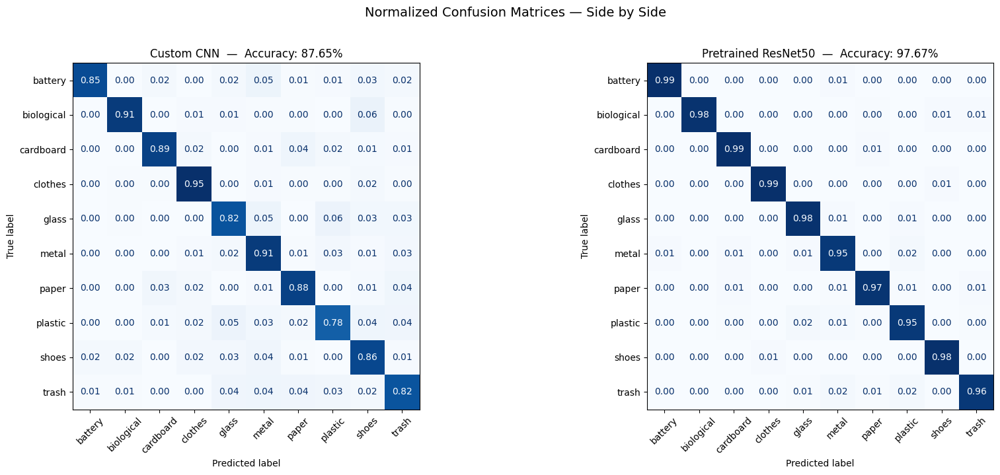
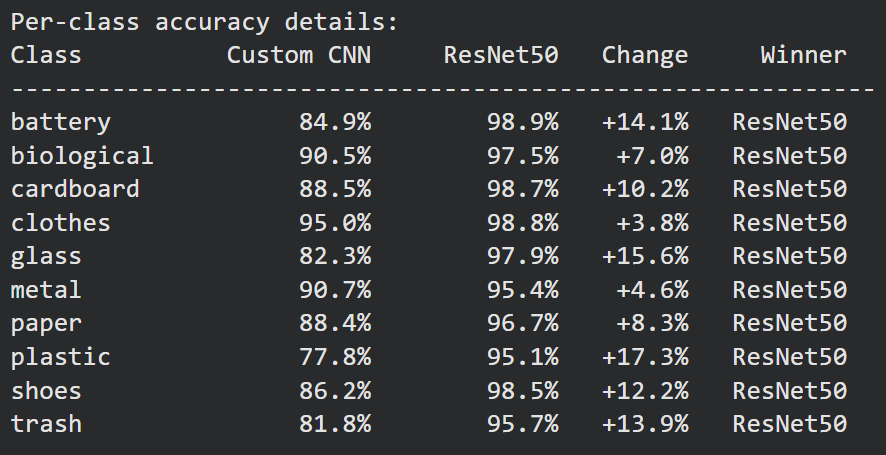
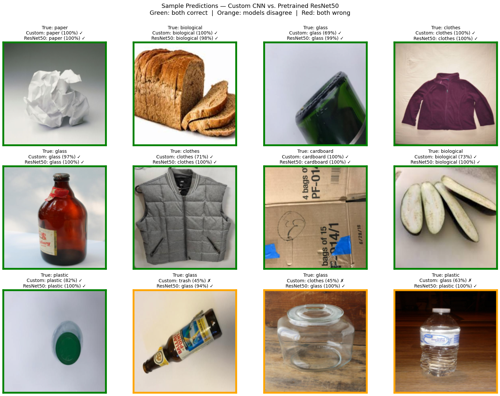

# Garbage Classification with Deep Learning

A computer vision project comparing two convolutional neural network approaches — a custom CNN trained from scratch and a fine-tuned pretrained ResNet50 — on a 10-class garbage classification task. Final validation accuracy: **97.67%**.

## Results

| Model | Validation Accuracy | Parameters | Approach |
|-------|---------------------|------------|----------|
| Custom CNN (from scratch) | **87.65%** | 3.9M | End-to-end training |
| Pretrained ResNet50 | **97.67%** | 23.5M | Two-stage fine-tuning |

### Per-Class Improvements with Transfer Learning

Transfer learning provided the largest gains on the most visually ambiguous classes:

| Class | Custom CNN | ResNet50 | Improvement |
|-------|-----------|----------|-------------|
| plastic | 77.8% | 95.1% | **+17.3%** |
| glass | 82.3% | 97.9% | **+15.6%** |
| battery | 84.9% | 98.9% | **+14.1%** |
| trash | 81.8% | 95.7% | **+13.9%** |
| shoes | 86.2% | 98.5% | **+12.2%** |
| cardboard | 88.5% | 98.7% | +10.2% |
| paper | 88.4% | 96.7% | +8.3% |
| biological | 90.5% | 97.5% | +7.0% |
| metal | 90.7% | 95.4% | +4.6% |
| clothes | 95.0% | 98.8% | +3.8% |

Beyond raw accuracy, the pretrained model also produced significantly better-calibrated confidence — classifying ambiguous samples at 99–100% confidence where the custom CNN typically hovered at 70–80%.

## Visualizations

### Confusion Matrices

Side-by-side normalized confusion matrices for both models on the validation set. The custom CNN shows substantial off-diagonal noise; ResNet50 produces a near-clean diagonal.



### Per-Class Accuracy

Per-class accuracy comparison showing where transfer learning provided the largest gains.



### Sample Predictions

Sample predictions from both models on random validation images. Green borders indicate both models predicted correctly; orange indicates disagreement; red indicates both models were wrong.



## Overview

This project classifies images of waste into 10 categories: **battery, biological, cardboard, clothes, glass, metal, paper, plastic, shoes, and trash**. Two approaches are implemented and compared in detail:

1. **Custom CNN trained from scratch** — demonstrates fundamental architecture design choices (BatchNorm, Global Average Pooling, progressive channel doubling) and full training pipeline engineering.

2. **Transfer learning with pretrained ResNet50** — applies modern best practices: ImageNet-pretrained backbone, two-stage training strategy (feature extraction warm-up followed by full fine-tuning with reduced learning rate).

The notebook compares the two side by side with consistent evaluation methodology, including per-class precision/recall/F1 metrics, raw and normalized confusion matrices, and direct visual comparison of predictions.

## Methodology

### Custom CNN Architecture

A 5-block convolutional network with progressive channel doubling (64 → 128 → 256 → 512 → 512), BatchNorm after every convolution, Global Average Pooling to eliminate the large fully-connected bottleneck, and dropout regularization in the classifier head. Roughly 3.9M parameters.

### Transfer Learning Strategy

ResNet50 with IMAGENET1K_V2 weights, final classification layer replaced for 10 garbage classes. Trained in two stages:

- **Stage 1 (5 epochs, lr=1e-3)**: Backbone frozen, classifier head only. Allows the new head to learn from random initialization without disrupting pretrained features.
- **Stage 2 (15 epochs, lr=1e-4)**: All layers unfrozen, full fine-tuning. Smaller learning rate gently adapts the backbone to garbage-specific features while preserving general visual knowledge.

### Shared Engineering Practices

- **Reproducibility**: Fixed random seeds across PyTorch, NumPy, and Python's random module
- **Proper train/validation split**: Separate transform pipelines (augmentation only on training) with fixed-seed indices for consistent splits
- **Data augmentation**: RandomResizedCrop, horizontal flips, rotation, color jitter
- **Class imbalance handling**: Balanced class weights computed from training distribution, applied to cross-entropy loss
- **Learning rate scheduling**: ReduceLROnPlateau to refine convergence
- **Best-model selection**: Weights at peak validation accuracy preserved, not the final epoch
- **Comprehensive evaluation**: Per-class precision/recall/F1, confusion matrices (both raw counts and row-normalized), sample prediction visualizations with confidence scores

## Tech Stack

- **PyTorch** + **torchvision** — model definition, training, pretrained weights
- **scikit-learn** — class weight computation, classification metrics, confusion matrices
- **matplotlib** — training curves, confusion matrix and comparison visualizations
- **NumPy** — array operations and seed control
- **Google Colab** (Pro tier) — GPU training environment

## Project Structure

```
garbage-classification/
├── README.md
├── LICENSE
├── requirements.txt
├── .gitignore
└── garbage_classification_10_classes.ipynb
```

## How to Run

### Prerequisites

```bash
pip install -r requirements.txt
```

A CUDA-capable GPU is strongly recommended. The notebook was developed on Google Colab with a T4/A100 GPU.

### Dataset

The dataset is a 10-class garbage image collection containing ~19,762 images. Download it and arrange it as:

```
garbage_dataset_v2/
├── battery/
├── biological/
├── cardboard/
├── clothes/
├── glass/
├── metal/
├── paper/
├── plastic/
├── shoes/
└── trash/
```

Update the `DATA_DIR` path in the dataset loading cell to point to your dataset location.

### Running the Notebook

Open `garbage_classification_10_classes.ipynb` in Jupyter or Google Colab and run cells top to bottom. The notebook supports two execution paths:

**Option 1: Train from scratch (~80 minutes on a T4 GPU)**

Run all cells in order. Training cells for both models will execute fully and save best weights to disk.

**Option 2: Skip training and load pretrained weights (a few minutes)**

The notebook includes optional "Load pretrained weights" cells immediately before each training cell. To skip training:

1. Download the pretrained weights from the [Releases page](../../releases) (`custom_cnn_best.pth` and `resnet50_best.pth`)
2. Update the `WEIGHTS_DIR` variable in the load cells to point to where you saved them
3. Run the load cell **instead of** the corresponding training cell
4. Continue with the evaluation, visualization, and comparison cells

## Pretrained Weights

Trained model weights are available in the [Releases section](../../releases) of this repository. Both files combined are approximately 100MB.

- `custom_cnn_best.pth` — best weights for the custom CNN (~16MB)
- `resnet50_best.pth` — best weights for the fine-tuned ResNet50 (~94MB)

## Key Takeaways

- A well-engineered from-scratch CNN can reach competitive accuracy (87.65%), but transfer learning yields substantially better results (97.67%) with comparable training time.
- The benefit of pretrained features is largest on the hardest classes — visually ambiguous categories like plastic and glass — where domain-specific data alone is insufficient to learn robust feature representations.
- Class-weighted loss successfully handled significant class imbalance (clothes had ~5.6× more samples than battery), but introduced a precision/recall asymmetry that was largely resolved by the stronger features of the pretrained model.
- Best-model checkpointing by validation accuracy and ReduceLROnPlateau scheduling were essential for extracting maximum performance from both architectures.
